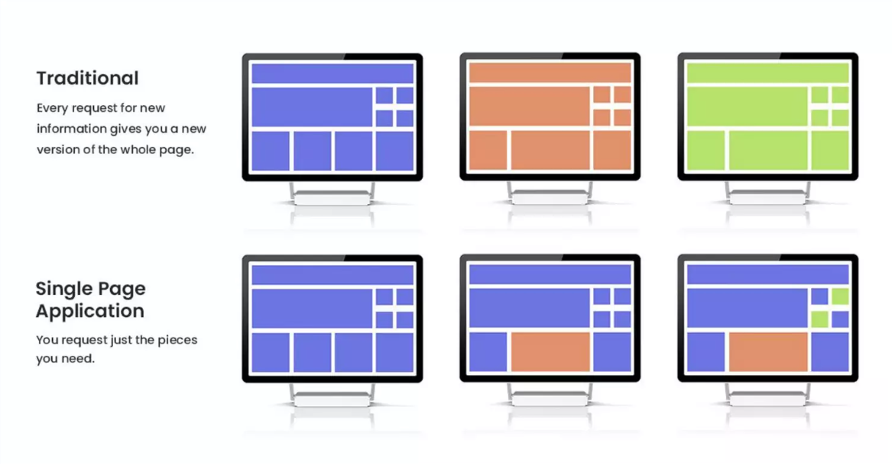
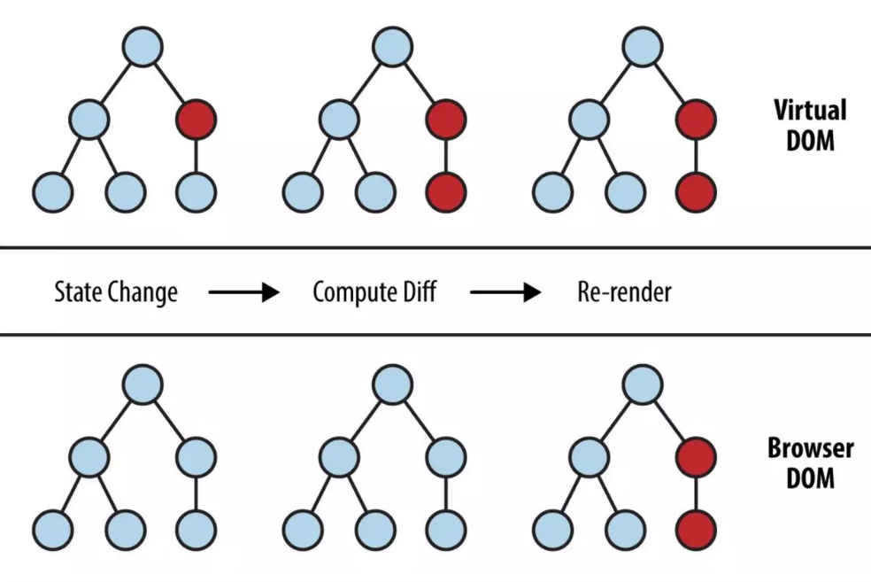

# Introdução ao ReactJS

Fundamentos Básicos do React e porque utilizá-lo.

<div class="uppercase text-sm tracking-widest">Sam Marxz</div>

<div class="abs-bl mx-14 my-12 ">
  
</div>


---
layout: 'intro'
---

# Sam Marxz

<div class="leading-8 opacity-80">
UI/UX Designer e Desenvolvedor Front-end especiliazado em React.<br>
Desenvolvedor desde do tempo que sites eram criados com tabelas.<br>
Entusiasta Open-source e do Conhecimento livre.<br>
Mentor nas horas vagas :)<br>
</div>

<div class="my-10 w-min flex flex-col gap-y-4">
  <div class="flex items-center gap-x-2">
    <ri-github-line class="opacity-50"/>
    <a href="https://github.com/sammarxz"
    target="_blank">https://github.com/sammarxz</a>
  </div>
  <div class="flex items-center gap-x-2">
    <ri-twitter-line class="opacity-50"/>
    <a href="https://twitter.com/sammarxz"
    target="_blank">https://twitter.com/sammarxz</a>
  </div>
  <div class="flex items-center gap-x-2">
    <ri-linkedin-line class="opacity-50"/>
    <a href="https://linkedin.com/in/sammarxz"
    target="_blank">https://linkedin.com/in/sammarxz</a>
  </div>
</div>


---

# Conteúdo

<ul class="m-0 p-0 mt-8">
  <li class="list-none mt-4 text-xl">
  👉 &nbsp;O que é Reat?
  </li>
  <li class="list-none ml-0 mt-4 text-xl">
  👉 &nbsp;Um pouco de história
  </li>
  <li class="list-none ml-0 mt-4 text-xl">
  👉 &nbsp;Como Funciona
  </li>
  <li class="list-none ml-0 mt-4 text-xl">
  👉 &nbsp;Por que utilizar?
  </li>
  <li class="list-none ml-0 mt-4 text-xl">
  👉 &nbsp;Conceitos básicos
  </li>
</ul>


---
layout: center
---

# O que é React?

---
name: React
layout: center
---

<div class="grid grid-cols-2 gap-4">
  <div class="text-center pb-4">
    
    <div class="opacity-50 mt-4 my-2 text-sm">
      A biblioteca para web e interfaces de usuário nativas
    </div>
    <div class="text-center">
      <a class="!border-none" href="https://www.npmjs.com/package/react" target="__blank">
        
      </a>
      <a class="!border-none" href="">
        
      </a>
      <a class="!border-none" href="https://www.npmjs.com/package/react" target="__blank">
        
      </a>
      <a class="!border-none" href="https://react.dev" target="__blank">
        
      </a>
      <br>
      <a class="!border-none" href="https://github.com/facebook/react" target="__blank">
        
      </a>
    </div>
  </div>
  <div class="border-l border-gray-400 border-opacity-25 !all:leading-12 !all:list-none my-auto">

  - É uma biblioteca Open Source Javascript
  - Utilizada para construir UI rapidamente 
  - A ferramenta mais popular atualmente
  - Desenvolvida pelo Facebook em 2013
  - Usa `components` reutilizáveis
  </div>
</div>

---
layout: center
---

# Um pouco de história

---

# Pré-React

<ol class="relative border-l border-gray-200 dark:border-gray-700 mt-8">
  <li class="mb-10 ml-4 list-none flex flex-col gap-y-2">
    <div class="flex items-center">
      <div class="absolute w-3 h-3 bg-cyan rounded-full -left-1.5 border border-white dark:border-gray-900 dark:bg-gray-700"></div>
      <time class="text-sm font-normal leading-none text-gray-400 dark:text-gray-500">2006</time>
    </div>
    <div class="flex flex-col">
      <h3 class="text-lg font-semibold text-gray-900 dark:text-white">Nasce o reinado do jQuery</h3>
      <p class="text-base font-normal text-gray-500 dark:text-gray-400 m-0">
        Surge para ajudar os desenvolvedores a interagirem mais facilmente com o
        DOM de todos os navegadores.
      </p>
    </div>
  </li>
  <li class="mb-10 ml-4 list-none flex flex-col gap-y-2">
    <div class="flex items-center">
      <div class="absolute w-3 h-3 bg-cyan rounded-full -left-1.5 border border-white dark:border-gray-900 dark:bg-gray-700"></div>
      <time class="text-sm font-normal leading-none text-gray-400 dark:text-gray-500">2010</time>
    </div>
    <div class="flex flex-col gap-y-1">
      <h3 class="text-lg font-semibold text-gray-900 dark:text-white">Surge o Angular.js</h3>
      <p class="text-base font-normal text-gray-500 dark:text-gray-400 m-0">
        Criado pelo Google para desenvolvimento de aplicações no padrão MVC
        (model, view, controller) que permitia o desenvolvimento de aplicações
        robustas.
      </p>
    </div>
  </li>
  <li class="mb-10 ml-4 list-none flex flex-col gap-y-2">
    <div class="flex items-center">
      <div class="absolute w-3 h-3 bg-cyan rounded-full -left-1.5 border border-white dark:border-gray-900 dark:bg-gray-700"></div>
      <time class="text-sm font-normal leading-none text-gray-400 dark:text-gray-500">2013</time>
    </div>
    <div class="flex flex-col gap-y-1">
      <h3 class="text-lg font-semibold text-gray-900 dark:text-white">Surgimento do React.JS</h3>
      <p class="text-base font-normal text-gray-500 dark:text-gray-400 m-0">
        Surge da necessidade ainda maior de organizar e contruir aplicações
        ainda mais interativas que fossem performáticas, de fácil manutenção e
        escalabilidade.
      </p>
    </div>
  </li>
</ol>

---

# Exemplo Javascript Moderno

<div class="my-10">
<iframe height="380" style="width: 100%;" scrolling="no" title="Github User View (Vanilla JS)" src="https://codepen.io/sammarques/embed/zYJMwpK?default-tab=html%2Cresult" frameborder="no" loading="lazy" allowtransparency="true" allowfullscreen="true">
  See the Pen <a href="https://codepen.io/sammarques/pen/zYJMwpK">
  Github User View (Vanilla JS)</a> by Sam Marxz (<a href="https://codepen.io/sammarques">@sammarques</a>)
  on <a href="https://codepen.io">CodePen</a>.
</iframe>
</div>

---

# Exemplo jQuery

<div class="my-10">
<iframe height="380" style="width: 100%;" scrolling="no" title="TodoList with AjaxCall Jquery" src="https://codepen.io/sammarques/embed/JjaeJpa?default-tab=html%2Cresult" frameborder="no" loading="lazy" allowtransparency="true" allowfullscreen="true">
  See the Pen <a href="https://codepen.io/sammarques/pen/JjaeJpa">
  TodoList with AjaxCall Jquery</a> by Sam Marxz (<a href="https://codepen.io/sammarques">@sammarques</a>)
  on <a href="https://codepen.io">CodePen</a>.
</iframe>
</div>

---

# Exemplo Angular.JS

<div class="my-10">
<iframe height="380" style="width: 100%;" scrolling="no" title="TodoList with Angular.JS" src="https://codepen.io/sammarques/embed/wvEQeVg?default-tab=html%2Cresult" frameborder="no" loading="lazy" allowtransparency="true" allowfullscreen="true">
  See the Pen <a href="https://codepen.io/sammarques/pen/wvEQeVg">
  TodoList with Angular.JS</a> by Sam Marxz (<a href="https://codepen.io/sammarques">@sammarques</a>)
  on <a href="https://codepen.io">CodePen</a>.
</iframe>
</div>

---

# Exemplo React.JS

<div class="my-10">
<iframe height="380" style="width: 100%;" scrolling="no" title="TodoList with React.JS" src="https://codepen.io/sammarques/embed/ZEMmJJm?default-tab=html%2Cresult" frameborder="no" loading="lazy" allowtransparency="true" allowfullscreen="true">
  See the Pen <a href="https://codepen.io/sammarques/pen/ZEMmJJm">
  TodoList with React.JS</a> by Sam Marxz (<a href="https://codepen.io/sammarques">@sammarques</a>)
  on <a href="https://codepen.io">CodePen</a>.
</iframe>
</div>

---
layout: center
---

# Como funciona?

---

# SPA (Single Page Application)



---
layout: center
---

# Por que React?

---
layout: image
image: https://miro.medium.com/v2/resize:fit:1100/format:webp/1*yl_2k3SZpeG8r7CxM_wZZg.png
---

---
layout: center
---

<div align="center">

<h3 class="text-xs">Inclusive:</h3>


</div>

---
layout: center
---

# Conceitos Básicos

---

# Conceitos

- Arquitetura
- Virtual DOM
- JSX
- Componentes
- Props
- States
- Capturando eventos

---
layout: center
---

# Arquitetura

---
layout: image
image: assets/arquitetura.png
---

---
layout: image
image: assets/hibrido.png
---

---
layout: center
---

# Virtual DOM

---

# DOM (Document Object Model)

<v-clicks>

- Representação em árvore da página, começando na tag `<html>`, descendo para cada filho, que são chamados de nós `nodes`.
- Ele é mantido na memória do navegador e vinculado diretamente ao que você vê em uma página.
- A cada mudança no DOM, o navegador tem duas operações:
  - **Repaint:** alterações visuais ou de conteúdo em um elemento que não afetam o layout e o posicionamento em relação a outros elementos
  - **Reflow:** recalcula o layout de uma parte da página - ou o layout da página inteira


</v-clicks>


<div class="mt-3">

<v-clicks>

```javascript
document.getElementById(id)
document.getElementsByTagName(name)
document.createElement(name)
parentNode.appendChild(node)
element.setAttribute()
element.getAttribute()
element.addEventListener()
element.innerHTML
```

</v-clicks>

</div>

---

# VirtualDOM

<v-clicks>

- O React mantém uma cópia dos elementos do DOM na memória.
- Ajuda o navegador a usar menos recursos quando mudanças precisam ser feitas em uma página.
- O principal é que o React agrupa muitas das alterações e executa uma atualização única no DOM real, 
alterando todos os elementos que precisam ser alterados ao mesmo tempo, portanto, o repaint e o 
reflow que o navegador deve executar para renderizar as alterações são executado apenas uma vez.


</v-clicks>

<v-clicks>


</v-clicks>

---



---
layout: center
---

# JSX

---

# JSX (JavaScript Extension)

<v-clicks>

- É uma extensão da linguagem JavaScript que é usada pelo React para criar interfaces de usuário.
- Permite que você misture código JavaScript com sintaxe de HTML.
- Não é interpretado pelo navegador. Precisa ser transpilado com ferramentas
  como o Babel.

</v-clicks>


<div class="grid grid-cols-2 gap-x-4 mt-8">

<v-click>


```jsx {1|2|2-8|all}
const Nav = (
  <nav className="navbar">
    <ul>
      <li><a href="#">Início</a></li>
      <li><a href="#">Sobre</a></li>
      <li><a href="#">Contato</a></li>
    </ul>
  </nav>
)
```

</v-click>
<v-click>

```javascript {1|2|3|all} {maxHeight:'178px'}
var Nav = React.createElement(
  "nav",
  { className: "navbar" },
  React.createElement(
    "ul",
    null,
    React.createElement(
      "li",
      null,
      React.createElement(
        "a",
        { href: "#" },
        "Inicio"
      )
    ),
    React.createElement(
      "li",
      null,
      React.createElement(
        "a",
        { href: "#" },
        "Sobre"
      )
    ),
React.createElement(
      "li",
      null,
      React.createElement(
        "a",
        { href: "#" },
        "Contato"
      )
    )
  )
);
```

</v-click>

</div>

---
layout: center
---

# Components

---


---

# Anatomia de um `Component`

<div class="grid grid-cols-2 gap-x-4 mt-8">

<div class="row-span-full flex-1 flex-grow">

<v-click>

```bash {1|3|4|5|6|5} 
react-todo-app
    ...
    ├── src
    │    ├── components
    │    │      └── TodoApp.jsx
    │    ├── main.jsx
    ...
```

</v-click>

</div>


<div class="flex flex-col">

<v-click>

```tsx {1|2-7|10|all} {maxHeight:'142px'}
const TodoApp = () => {
  return (
    <div>
      <h1>Hello world!</h1>
      <p>I am in a React Component!</p>
    </div>
  );
};

export default TodoApp;
```

</v-click>

</div>

</div>

<div class="mt-2">

<v-click>

```tsx {1|2|4|6|7|9|all}
import React from "react";
import ReactDOM from "react-dom/client";

import TodoApp from "./components/TodoApp";

const domContainer = document.getElementById("root");
const root = ReactDOM.createRoot(domContainer);

root.render(<TodoApp />);
```

</v-click>

</div>

---
layout: center
---

# Props

---

# Props (propriedades)

<v-clicks>

- As props, ou "propriedades", são um tipo de dado que podem ser passados para
  um cpomponent React.
- Esses dados podem incluir coisas como texto, número, imagens, ou até mesmo
  outros componentes.
- Ao passar props para um componente, você pode personalizá-lo de acordo com
  suas necessidades.
- É passado sempre de "pai" para "filho"
- É apenas para `leitura`

</v-clicks>

<div class="mt-8">


<v-click>

Exemplo:

```html
<input type="submit" value="Submit" />
```

Temos um elemento `input` que recebe as propriedades:

- type
- value

</v-click>

</div>


---
layout: none
---

```tsx {2-10|2|5-7|13-28|16-20|17|18|19|16-26|all}
// O componente Post
function Post(props) {
  return (
    <div>
      <h1>{props.titulo}</h1>
      
      <p>{props.texto}</p>
    </div>
  );
}

// Usando o componente Post
function App() {
  return (
    <div>
      <Post
        titulo="Primeiro post"
        urlImagem="https://example.com/image1.jpg"
        texto="Lorem ipsum dolor sit amet, consectetur adipiscing elit."
      />
      <Post
        titulo="Segundo post"
        urlImagem="https://example.com/image2.jpg"
        texto="Sed do eiusmod tempor incididunt ut labore et dolore magna aliqua."
      />
    </div>
  );
}
```

---
layout: center
---

# States

---

# States (Estados)

<v-clicks>

- Um estado pode ser pensado como o mecanismo que move uma aplicação React.
- Declaramos um estado em um componente se os dados mudarem ao longo do tempo,
  geralmente pela interação do usuário, como por exemplo uma interação com um
  formulário.
- Diferente de `Props`, um Estado é local e específico daquele componente.
- São dados que podem ser gerenciáveis pelo componente.

Nós o gerenciamos usando o `useState`. Um função (hook) do react criada especificamente para lidar com isso. Primeiro importamos do `React`:

```tsx
import useState from 'react'
```

`useState()` aceita um valor inicial e retorna um `array []` contendo a nossa
variável de estado e uma função para alterar o seu valor:

```tsx
const [count, setCount] = useState(0)
```

</v-clicks>

---

# Exemplo de uso de `State`

<div class="mt-8">

```tsx {1|4|8|9|all}
import { useState } from 'react'

const Counter = () => {
  const [count, setCount] = useState(0)

  return (
    <div>
      <p>You clicked {count} times</p>
      <button onClick={() => setCount(count + 1)}>Click me</button>
    </div>
  )
}

ReactDOM.render(<Counter />, document.getElementById('app'))
```

</div>


---
layout: center
---

# Eventos

---

# Manipulando eventos no React

- Para nossa aplicação ser interativa é necessário que captremos algumas ações
  do usuário.
- Essas ações geralmente são utilizadas com o prefixo `on` e o nome da ação, por
  exemplo:
  - `onSubmit`
  - `onChange`
  - `onClick`
  - `onKeyDown`
  - `onMouseEnter`
  - `onMouseOver`

---

# Exemplos


<div class="mt-8 flex flex-col gap-y-4">

```tsx
<button onClick={e => {
  console.log(e); // React event object
}} />
```

```tsx {2|6|7|5-8|all}
function Form() {
  const [firstName, setFirstName] = useState(''); // Declare a state variable...
  // ...
  return (
    <input
      value={firstName} // ...force the input's value to match the state variable...
      onChange={e => setFirstName(e.target.value)} // ... and update the state variable on any edits!
    />
  );
}
```

</div>

---
layout: center
---

# Dúvidas?

---
layout: center
---

# Vlw, flw
